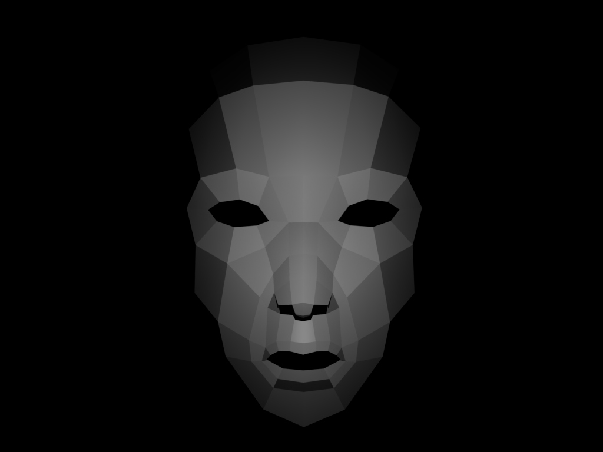
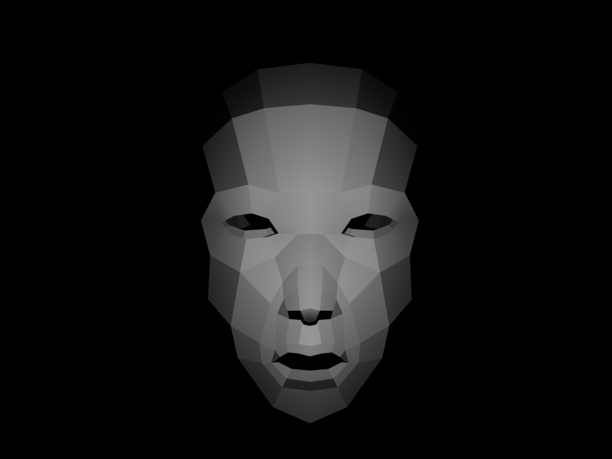
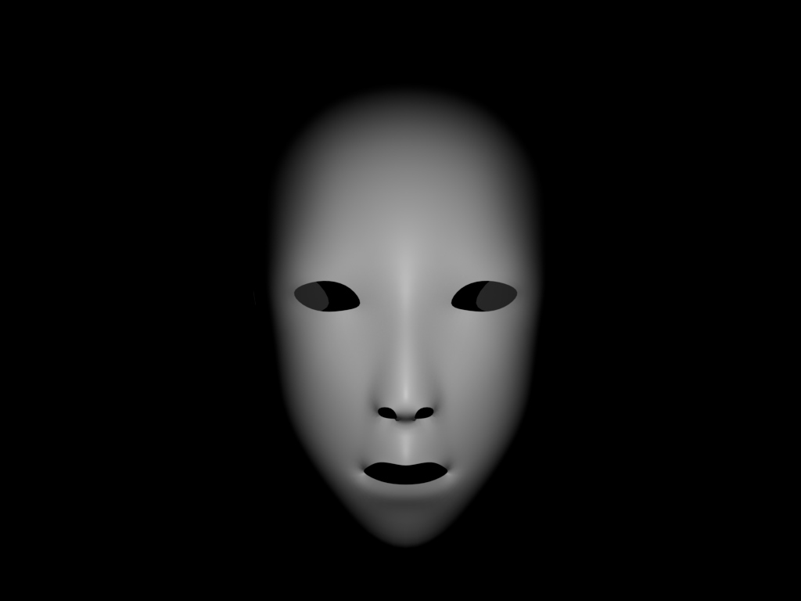
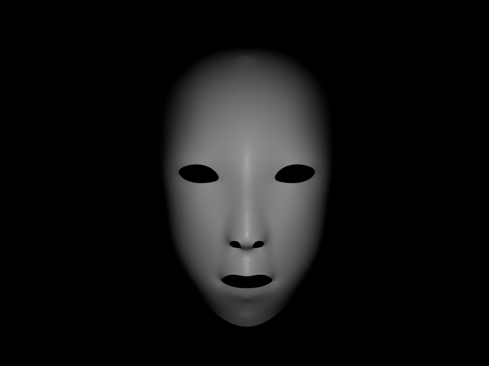
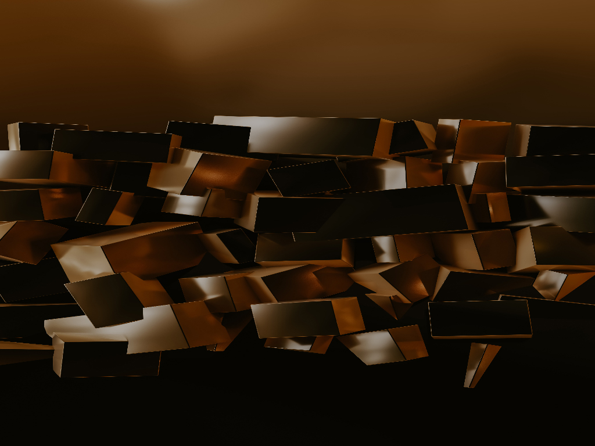

# _Look Me in the Eyes I_
~ artistic explanation here ~
<br><br><br>
## Technical Approach
_Look Me in the Eyes I_ is an image processor that rearranges or "remixes" the pixels of an source image to resemble a target image as closely as possible. I chose to accomplish this through the use of [openFrameworks](https://openframeworks.cc), an open source C++ toolkit for creative coding.
### Target Image Pixel Sorting
In computer memory, pixels for grayscale images are stored as an array of values where each pixel is represented by a single 8-bit number from 0 (black) to 255 (white) that looks something like this:
```
[  215  ,  125  ,  86  ,  35  ,  202  ,  174  ]
|______||______||_____||_____||_______||______|
 pixel0  pixel1  pixel2 pixel3  pixel4  pixel5

```
For color images, pixels are still stored as an array of 8-bit numbers, but now each pixel takes up three indexes for red, green, and blue values like so:
```
[  215  ,  125  ,  86  ,  35  ,  202  ,  174  ]
|______________________||_____________________|
   red    green   blue    red   green    blue

          pixel0                pixel1
```
Similarly, some images also use a fourth index for an "alpha" (opacity) channel. <br><br>
The best way to create a remix of the source image that closely resembles the target image is to map the pixels according to brightness. Therefore, I needed to know in what order the pixels were in terms of their brightness. For grayscale images, the brightness is just the pixel value itself and for color images it is an average of the red, green, and blue values. To sort the pixels, I chose to use the [counting sort](https://www.geeksforgeeks.org/counting-sort/) algorithm. This algorithm does not sort based on comparisons, so it is linear on the input size and range of inputs (O(n+k) where n is the input size and k is the range of input values). Since the range of brightness is small (0-255) in comparison with the number of pixels in an image (786,432 in a 1024x768 image), this is a very efficient algorithm to use for our purposes. To preserve the original indexes of each pixels, the array I sorted by brightness contained entries that were structs consisting of both the brightness and original index.

### Source Image Pixel Sorting
My original thought was to sort the pixels of the source image using counting sort just as I had for the target image. However, using the `std::sort()` function from C++ provided me with much more aesthetically pleasing results without sacrificing much efficiency (`std::sort()` is O(nlogn) and uses [introsort](https://www.geeksforgeeks.org/internal-details-of-stdsort-in-c/), which is perhaps the best algorithm to use if you know nothing about your data). For more on the aesthetics, see the *Results* section.

### Pixel Mapping
At this point I have two arrays of structs ordered by brightness. All that's left to do is map the pixels from the indexes in my source array (let's call it `sampleBrightness`) to the index contained in the matching index of the target array (`faceArr`) in a new image buffer. That might be a little confusing, so here's a picture and the code:
```
                   brightness  index in original image
faceArr          [(    192    ,           2           ), (112,0), (71,1)]

sampleBrightness [(166,1), (91, 2), (12,0)]
                        \     |        |
                         \    |        |
                          \  /         | 
                           \/          |
                           /\           \
                          /  \___________\____________________________________________
                         |                \__________                                 |
                         V                           V                                V
Image [pixel at index 2 in source image, pixel at index 0 in source image, pixel at index 1 in source image]
Index                0                                 1                                 2
```
```C++
for (int i = 0; i < n; i++) {
    Image.setColor(faceArr[i].i, SampleSrc.getColor(sampleBrightness[i].i));
}
```
Of course, you would have to multiply `" ".i` by 3 if working with color images

## Results
To test the processor, I downloaded source images from [Unsplash](https://unsplash.com) and resized them to all be 1024x768. For the target images, I used 1024x768 renders of a face model I made in Maya. <br>
   
   

### Sorting Algorithm Differences
The way in which `std::sort()` and counting sort conduct sorting are very different (one is sorting based on comparison and one is not), so the way that equal values are ordered in the final array are different between them. This is immediately apparent when looking at the outputs of the processor when using each algorithm. Below is the output using the first face model above as the target image and the third sample image as the source image with each of the sorting algorithms for each function: <br>
From left to right: counting sort on source and target, intro sort on source and target, counting sort on source and intro sort on target, intro sort on source and counting source on target

This project is a part of DART 496, an image/video processing and remix theory independent study with [Professor Eduardo Navas](http://navasse.net/docs/index.php). Resources used for _Look Me in the Eyes I_ include the [openFrameworks graphics documentation](https://openframeworks.cc/documentation/graphics/) and the chapter ["Image Processing and Computer Vision" from _ofBook_](https://openframeworks.cc/ofBook/chapters/image_processing_computer_vision.html)
